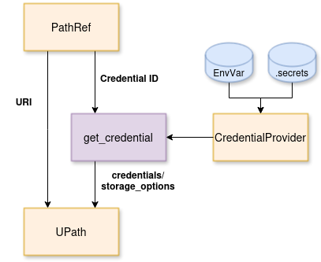

# Data Access Layer

* Abstracts the complexities of accessing data stored in various locations.
* Supports local paths and remote storage (S3, HTTP, etc.).
* Handles both anonymous and [authenticated](credentials.md) access.
* Essential for S2GOS, which works with heterogeneous datasets.

## Universal Pathlib

* Built on [`universal-pathlib`](https://universal-pathlib.readthedocs.io/en/latest/) (`UPath`).
* Combines [`pathlib`](https://docs.python.org/3/library/pathlib.html) interface with [`fsspec`](https://filesystem-spec.readthedocs.io/en/latest/) capabilities.
* Unified API for file operations across all filesystems.
* Credentials passed via `storage_options`.

### Limitations

* `UPath` stores credentials in `storage_options`, making it unsuitable for serialization.
* S2GOS config objects need to be serializable.
* Solution: `PathRef` - a serializable wrapper that references credentials by ID.

## PathRef

* Serializable path representation with credential reference.
* Two fields:
    - `value`: URI string (e.g., `"s3://bucket/data.zarr"`).
    - `cid`: credential ID (e.g., `"my_s3_creds"`) - *optional*.
* Resolves to `UPath` at runtime by looking up credentials from the provider.

```python
from s2gos_utils.io import PathRef

# Create a PathRef (serializable)
path = PathRef("s3://bucket/data.zarr", cid="my_s3_creds")

# Serialize to dict/JSON
config = path.model_dump()  # {"value": "s3://...", "cid": "my_s3_creds"}

# Resolve to UPath for file operations
upath = path.upath
data = upath.read_bytes()

# Path operations supported
subpath = path / "subfolder" / "file.nc"
```



## Summary

| Class | Serializable | File Operations | Use Case |
|-------|--------------|-----------------|----------|
| `PathRef` | Yes | No (resolve first) | Configuration, storage |
| `UPath` | No | Yes | Runtime file access |

## See Also

* [Credentials](credentials.md) - Setting up credential providers.